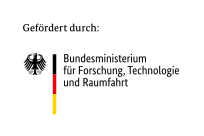
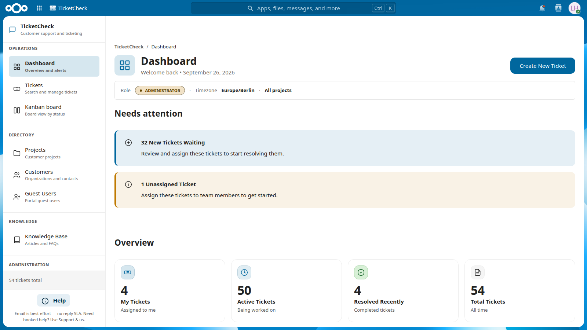
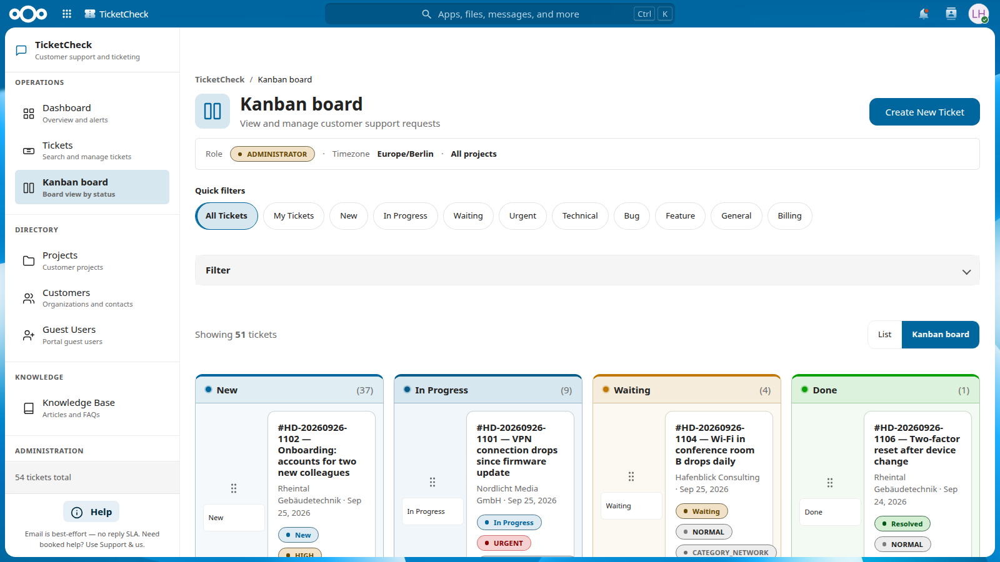
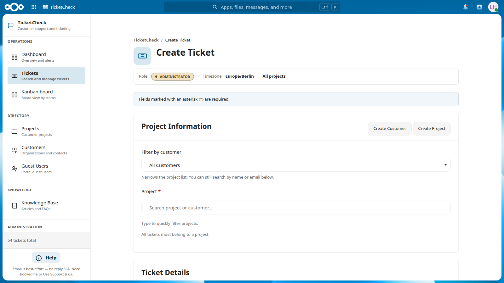
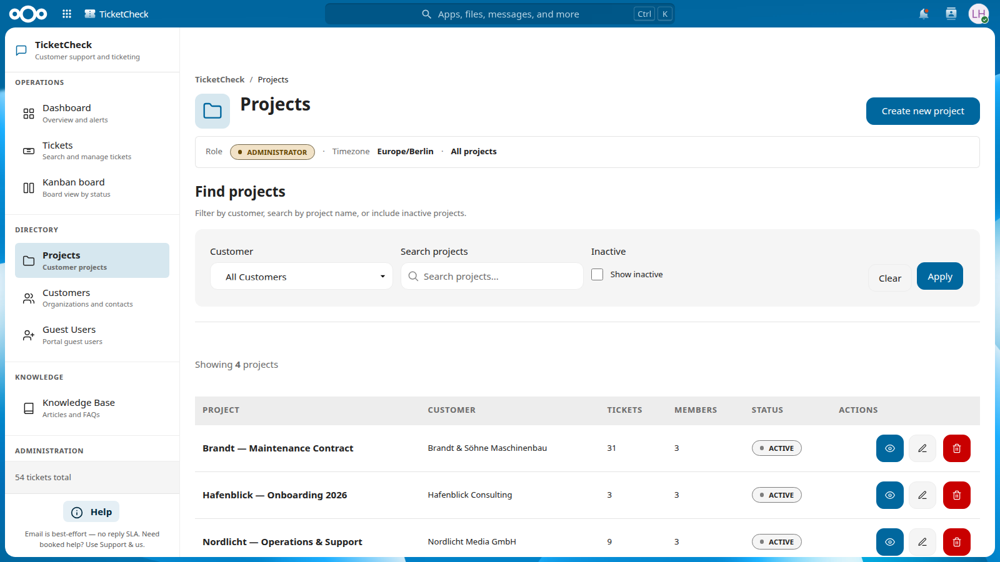
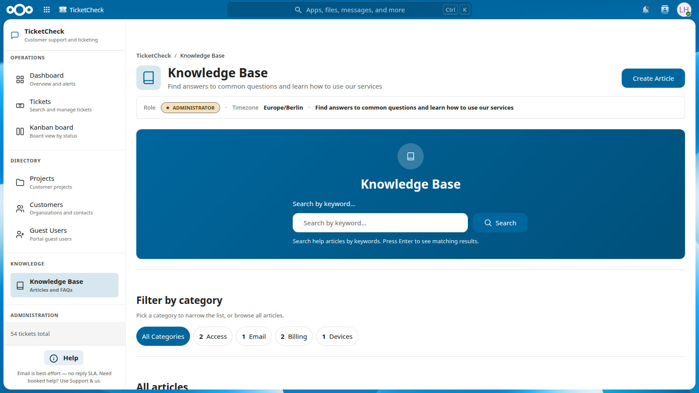
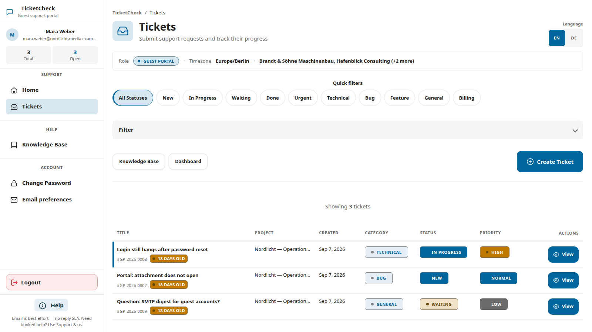

# TicketCheck (Helpdesk) for Nextcloud

App ID in Nextcloud: **`ticketcheck`**. Clone path:

```bash
git clone https://github.com/aSoftwareByDesignRepository/nextcloud-ticketcheck.git /path/to/nextcloud/apps/ticketcheck
```

---

A comprehensive customer support ticketing system with guest access and email integration for Nextcloud.

## Overview

The Helpdesk app provides a complete standalone helpdesk and customer support system for Nextcloud. It works out of the box with no dependencies and includes advanced features like multi-tenant project-based access control, secure guest portal, automated email notifications, and rich knowledge base management.

## Features

### Core Functionality
- **Multi-tenant Project-based Access Control**: Organize tickets by projects with granular permissions
- **Built-in Projects and Customers Management**: Complete CRM functionality integrated
- **Secure Guest Portal**: Restricted access for customers with isolated styling
- **Automated Email Notifications**: Background jobs for ticket updates and SLA monitoring
- **Inbound Email**: Webhook endpoint for SendGrid/Mailgun to capture customer replies as ticket comments
- **Email Threading (Reply-To)**: Configurable Reply-To header (support+{ticketId}@domain) for routing replies
- **Canned Responses**: Pre-defined templates with variable substitution for faster agent replies
- **Ticket Merge**: Combine duplicate tickets; move comments and attachments to target
- **Escalation Rules**: Auto-escalate by age, priority, or status; hourly background job
- **Satisfaction Survey**: Post-resolution feedback (1–5 stars + optional comment) for completed tickets
- **Rich Text Editor**: Advanced knowledge base with formatting and media support
- **File Attachments**: Support for various file types with image previews
- **Visual Charts and Reporting**: Dashboard analytics and performance metrics
- **CSV Export**: Data export capabilities for reporting
- **SLA Monitoring**: Automated breach alerts and escalation
- **Daily Digest Emails**: Agent notifications and summaries

### User Interface
- **Responsive Design**: Fully responsive for desktop, tablet, and mobile devices
- **Accessibility**: WCAG compliant with high contrast and reduced motion support
- **Multi-language Support**: English and German translations
- **Modern UI**: Clean, intuitive interface following Nextcloud design guidelines
- **Dark Mode Support**: Automatic theme detection and support

### Integration
- **Nextcloud Integration**: Native Nextcloud app with full integration
- **Email Integration**: SMTP support for notifications and ticket creation
- **User Management**: Integration with Nextcloud user and group management

## Installation

### Requirements
- Nextcloud 32 or higher
- PHP 8.2 or higher
- MySQL/MariaDB or PostgreSQL database
- SMTP server (optional, for email notifications)

### Installation Steps
1. Download the app files to your Nextcloud `apps` directory
2. Enable the app in Nextcloud admin settings
3. Run the database migrations automatically
4. Configure app settings as needed
5. Set up email notifications (optional)

## Configuration

### Admin Settings
- **Email Configuration**: SMTP settings for notifications, Reply-To with inbound address
- **Inbound Email**: Webhook token, inbound address (support+{ticketId}@domain for replies), enable/disable
- **Escalation Rules**: Configure auto-escalation by age, priority, status (runs hourly)
- **SLA Settings**: Response and resolution time limits
- **Project Management**: Default project settings and permissions
- **Guest Portal**: Customization options for customer portal
- **Knowledge Base**: Content management and categorization
- **Security**: Access control and rate limiting

### User Preferences
- **Dashboard Layout**: Customizable dashboard widgets
- **Notification Settings**: Email and in-app notifications
- **Language**: Interface language selection
- **Theme**: Light/dark mode preferences
- **Accessibility**: High contrast and reduced motion options

## Usage

### For Administrators

#### Setting Up Projects
1. Navigate to Projects section
2. Click "Create Project"
3. Fill in project details (name, description, customer, etc.)
4. Set SLA requirements and response times
5. Add team members and assign roles
6. Configure customer access permissions

#### Managing Customers
1. Go to Customers section
2. Click "Create Customer"
3. Enter customer information and contact details
4. Assign to projects
5. Set up guest access credentials
6. Configure notification preferences

#### Knowledge Base Management
1. Navigate to Knowledge Base
2. Create articles with rich text formatting
3. Organize by categories
4. Set publication status
5. Configure search and filtering

### For Agents

#### Ticket Management
1. View assigned tickets in dashboard
2. Update ticket status and priority
3. Add internal notes and comments
4. Attach files and documents
5. Escalate tickets when needed
6. Monitor SLA compliance

#### Customer Communication
1. Reply to customer tickets
2. Add internal notes (hidden from customers)
3. Update ticket status and assignments
4. Send notifications and updates
5. Track communication history

### For Customers (Guest Portal)

#### Accessing Support
1. Visit the guest portal URL
2. Log in with provided credentials
3. View assigned tickets and status
4. Create new support requests
5. Browse knowledge base
6. Upload files and documents

#### Creating Tickets
1. Click "Create New Ticket"
2. Fill in ticket details and description
3. Select appropriate category and priority
4. Attach relevant files
5. Submit ticket for review

## API

The app provides a REST API for integration:

### Tickets
- `GET /api/tickets` - List tickets
- `POST /api/tickets` - Create ticket
- `GET /api/tickets/{id}` - Get ticket details
- `PUT /api/tickets/{id}` - Update ticket
- `DELETE /api/tickets/{id}` - Delete ticket

### Projects
- `GET /api/projects` - List projects
- `POST /api/projects` - Create project
- `GET /api/projects/{id}` - Get project details
- `PUT /api/projects/{id}` - Update project
- `DELETE /api/projects/{id}` - Delete project

### Customers
- `GET /api/customers` - List customers
- `POST /api/customers` - Create customer
- `GET /api/customers/{id}` - Get customer details
- `PUT /api/customers/{id}` - Update customer
- `DELETE /api/customers/{id}` - Delete customer

### Knowledge Base
- `GET /api/kb/articles` - List articles
- `POST /api/kb/articles` - Create article
- `GET /api/kb/articles/{id}` - Get article details
- `PUT /api/kb/articles/{id}` - Update article
- `DELETE /api/kb/articles/{id}` - Delete article

### Inbound Email Webhook
- `POST /inbound-email/webhook` - Receive inbound emails (SendGrid/Mailgun). Requires `X-Webhook-Token` header. Config: `inbound_email_webhook_token`, `inbound_email_address`, `inbound_email_enabled`.

## Development

### Shell, assets, and guest routing

- **Staff and in-app guest pages** use `PageRenderTrait` → `templates/common/page-start.php` / `page-end.php` and `lib/Service/FrontEndAssetService.php` for CSS/JS load order (`css/common/tokens.css` and `css/app.css` via `app`; shared `js/common/*` then page scripts).
- **Standalone guest shell** (`templates/layout.guest.php`) registers `i18n`, `guest-layout-boot`, and `gdpr-notice` for CSP and body-class behaviour; page bodies use the same `tc-*` shell via `page-start` / `page-end`.

### Tests and automated gates

From `apps/ticketcheck/`:

```bash
./vendor/bin/phpunit -c phpunit.xml
node ./scripts/lint-grep-gates.js
npm run lint
npm run l10n:check
php ./scripts/validate-templates.php
```

With Docker (example: Nextcloud service named `nextcloud`, app bind-mounted under `custom_apps`):

```bash
docker compose exec -T nextcloud php /var/www/html/custom_apps/ticketcheck/vendor/bin/phpunit -c /var/www/html/custom_apps/ticketcheck/phpunit.xml
```

### Project Structure
```
helpdesk/
├── appinfo/           # App configuration
├── lib/              # PHP classes
│   ├── Controller/   # Controllers
│   ├── Service/      # Business logic
│   ├── Db/          # Database entities and mappers
│   ├── Exception/   # Custom exceptions
│   ├── Listener/    # Event listeners
│   └── AppInfo/     # Application bootstrap
├── templates/        # PHP templates
│   ├── portal/       # Guest portal templates
│   └── *.php         # Main app templates
├── css/              # Stylesheets
│   ├── app.css       # Design system + shell (imports tokens + legacy layers during migration)
│   └── common/
│       └── tokens.css
├── js/               # JavaScript files
├── l10n/            # Translation files
└── migrations/       # Database migrations
```

### Database Schema
- `oc_helpdesk_tickets` - Ticket information
- `oc_helpdesk_projects` - Project data
- `oc_helpdesk_customers` - Customer data
- `oc_helpdesk_comments` - Ticket comments
- `oc_helpdesk_attachments` - File attachments
- `oc_helpdesk_kb_articles` - Knowledge base articles

### Responsive Design
The app includes comprehensive responsive design with breakpoints:
- **Desktop (1200px+)**: Full sidebar navigation and multi-column layouts
- **Tablet (800px-1200px)**: Horizontal navigation with optimized grids
- **Mobile (600px-800px)**: Single column layout with scroll navigation
- **Small Mobile (400px-600px)**: Ultra-compact design

### Accessibility Features
- **WCAG 2.1 AA Compliance**: High contrast, keyboard navigation, screen reader support
- **Touch Targets**: Minimum 44px touch targets for mobile devices
- **Reduced Motion**: Support for users with motion sensitivity
- **High Contrast**: Enhanced contrast for better visibility
- **Screen Reader**: Proper ARIA labels and semantic HTML

### Contributing
1. Fork the repository
2. Create a feature branch
3. Make your changes
4. Add tests if applicable
5. Ensure responsive design works
6. Test accessibility features
7. Submit a pull request

## License

This app is licensed under the **AGPL-3.0-or-later** license.

### License Details
- **SPDX-License-Identifier**: AGPL-3.0-or-later
- **Copyright**: 2025-2026 Lara Raffel, Alexander Mäule, Hauke Klünder, and Nextcloud contributors
- **Authors**: Lara Raffel, Alexander Mäule, Hauke Klünder
- **Repository**: [github.com/aSoftwareByDesignRepository/nextcloud-ticketcheck](https://github.com/aSoftwareByDesignRepository/nextcloud-ticketcheck)

## Support

For support and questions:
- **Documentation**: Check this README and inline code documentation
- **Issues**: Report issues on [GitHub](https://github.com/aSoftwareByDesignRepository/nextcloud-ticketcheck/issues)
- **Repository**: [GitHub Repository](https://github.com/aSoftwareByDesignRepository/nextcloud-ticketcheck)

## Funding

<a href="https://www.bmftr.bund.de/"></a>&nbsp;&nbsp;&nbsp;
<a href="https://www.prototypefund.de/"></a>

TicketCheck (grant project **NEXTICK**) is funded by the German Federal Ministry of Research, Technology and Space (BMFTR) through the [Prototype Fund](https://www.prototypefund.de/) programme — funding measure "Software Sprint – Förderung von Open Source Entwicklerinnen und Entwicklern" ([BAnz vom 15.11.2024](https://www.bmftr.bund.de/SharedDocs/Bekanntmachungen/DE/2024/11/2024-11-15-bekanntmachung-software-sprint.html)), round 2, funding period June to November 2026.

*TicketCheck (Förderprojekt NEXTICK) wird vom Bundesministerium für Forschung, Technologie und Raumfahrt (BMFTR) im Förderprogramm Prototype Fund gefördert — Fördermaßnahme „Software Sprint – Förderung von Open Source Entwicklerinnen und Entwicklern" (BAnz vom 15.11.2024), 2. Jahrgang, Förderzeitraum Juni bis November 2026.*

TicketCheck is free and open-source software, released under the [AGPL-3.0-or-later](LICENSE) license. The complete source code is public — that is a condition of the funding.

## Changelog

See [CHANGELOG.md](CHANGELOG.md) for the release history (latest: **2.3.8**).

## Guest portal routing (staff vs guest shell)

TicketCheck uses **two presentation paths** for guests. Both enforce the same permissions on the server; only chrome and boot scripts differ.

| Path | Shell | Typical routes | Assets |
|------|--------|----------------|--------|
| **In-app portal** | `templates/common/page-start.php` with `$mode = 'guest'` | `/apps/ticketcheck/portal/*` (home, tickets, KB, password, email prefs) | `FrontEndAssetService` → `tokens.css` + `app.css` + page JS |
| **Standalone guest layout** | `templates/layout.guest.php` | NC login / password reset flows that must not load staff `#app-navigation` | `app.css` + `guest-layout-boot.js`, `gdpr-notice.js`, `i18n.js` |

**Defense in depth:** `Application::boot()` and `GlobalGuestRequestListener` redirect guests away from non-allowlisted `/apps/ticketcheck/*` paths to the portal home. Direct URLs to create-ticket show a **blocked** state when `canGuestCreateTicket()` is false; `storeTicket()` still returns **403**.

**Verification:** `npm run verify:ui` (grep, templates, l10n, CSS imports, JS asset registry) and `docker compose exec nextcloud ./custom_apps/ticketcheck/vendor/bin/phpunit -c custom_apps/ticketcheck/phpunit.xml`.

**Playwright:** [e2e/README.md](e2e/README.md).

## Technical Specifications

### System Requirements
- **Nextcloud**: 32 or higher
- **PHP**: 8.2 or higher
- **Database**: MySQL 5.7+, MariaDB 10.3+, PostgreSQL 12+
- **Memory**: 128MB minimum, 256MB recommended
- **Storage**: 50MB for app files, additional space for attachments

### Performance
- **Database Optimization**: Indexed queries and efficient joins
- **Caching**: Template and data caching for improved performance
- **Lazy Loading**: On-demand resource loading
- **Compression**: CSS and JavaScript minification
- **CDN Ready**: Static asset optimization

### Security
- **Input Validation**: Comprehensive input sanitization
- **CSRF Protection**: Cross-site request forgery prevention
- **XSS Prevention**: Output encoding and content security policy
- **SQL Injection**: Parameterized queries and prepared statements
- **Access Control**: Role-based permissions and guest restrictions
- **Rate Limiting**: API and form submission rate limiting

## Publishing to the Nextcloud App Store

1. **Requirements**: Ensure `LICENSE` (AGPL-3.0), `CHANGELOG.md`, and `README.md` are up to date. `appinfo/info.xml` must have valid `bugs`, `repository`, and `author` (with `mail` and `homepage`).
2. **Version**: Bump version in `appinfo/info.xml` and add an entry in `CHANGELOG.md` for the release.
3. **Package**: Create a release archive containing the app directory (e.g. `ticketcheck/`) with all app files. Exclude `.git`, `node_modules`, `tests`, `.github`, and other development-only paths. Do not over-restrict `max-version` in `info.xml` so users on newer Nextcloud can install.
4. **Signing**: Sign the app with `occ integrity:sign-app` using your private key and certificate. Submit the CSR to Nextcloud for an official certificate if publishing to the store.
5. **Submit**: Upload the signed archive at [apps.nextcloud.com](https://apps.nextcloud.com) and fill in the app ID and repository URL.

## Screenshots

| Dashboard | Kanban board | Create ticket |
| --- | --- | --- |
|  |  |  |

| Projects | Knowledge base | Guest portal |
| --- | --- | --- |
|  |  |  |

## Roadmap

### Planned Features
- **Advanced Reporting**: Custom report builder
- **Mobile App**: Official agent companion (Expo) — agent seats; guests stay on the portal
- **API Extensions**: Additional API endpoints
- **Third-party Integrations**: Slack, Teams, Discord
- **Advanced Analytics**: Machine learning insights
- **Multi-language**: Additional language support

### Known Issues
- None currently known

## Acknowledgments

- **BMFTR**: Funded by the German Federal Ministry of Research, Technology and Space through the "Software Sprint" funding measure ([BAnz vom 15.11.2024](https://www.bmftr.bund.de/SharedDocs/Bekanntmachungen/DE/2024/11/2024-11-15-bekanntmachung-software-sprint.html))
- **Prototype Fund**: The Open Knowledge Foundation team that runs the programme — for selecting NEXTICK (round 2) and supporting it with coaching, advice and the grantee community throughout the funding period
- **Nextcloud GmbH**: For the excellent Nextcloud platform
- **Contributors**: All developers who contributed to this project
- **Community**: Nextcloud community for feedback and testing
- **Open Source**: Built on open source technologies and principles

---

**Copyright © 2025-2026 Lara Raffel, Alexander Mäule, Hauke Klünder**  
**Licensed under AGPL-3.0-or-later**
